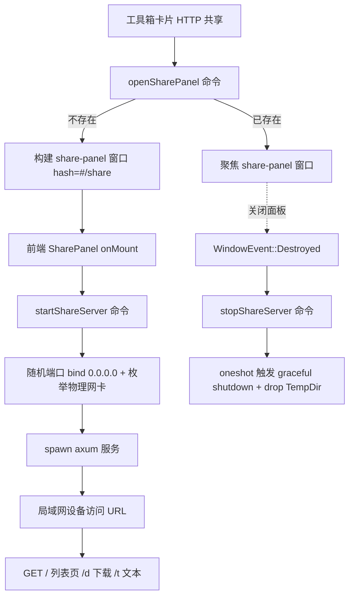

## 用户需求

在 jPaste 工具箱中新增「HTTP 共享服务器」功能：点击工具箱卡片打开「共享面板」，自动启动一个本地 HTTP 服务；主机可通过文件对话框、拖拽、文本输入往共享列表添加内容；局域网内其他设备通过访问 URL 下载文件、复制文本。面板关闭即停止服务、清理临时目录。

## 产品概述

「HTTP 共享服务器」是一个工具箱卡片触发的单例控制面板 + 后台 HTTP 服务。它把当前设备变成一个轻量局域网文件/文本共享站，面向手机等无法便捷接收文件的设备，扫码即可取走内容。

## 核心功能

- 单例「共享面板」：固定窗口标签 `share-panel`，再次点击只聚焦不新建。
- 服务生命周期绑定窗口：打开面板自动启动服务，关闭（销毁）面板自动停止并清理。
- 混合条目列表：文件可下载、文本可复制到客户端自身剪贴板，支持同时多条。
- 主机添加方式：文件选择对话框（多选）、拖拽文件、文本输入框。
- 无口令访问控制：监听 `0.0.0.0`，仅枚举物理网卡（Wi-Fi/以太网）IPv4，每个 IP 一条独立 URL，各带复制按钮与可展开二维码。
- 端口每次随机空闲端口；条目仅手动删除，窗口关闭清空会话与临时目录；单向（主机→局域网，客户端不回传）。

## 设计依据

上述全部决策已在 `CONTEXT.md` 的 `ShareServer` 术语、`docs/adr/0002-share-server-axum.md`、`docs/prd-aggregator.md` 第 13 节中对齐并记录，本计划据此落地。

## 技术栈

- 桌面框架：Tauri 2（Rust 后端 + Preact/TypeScript 前端，与现有项目一致）
- 后端 HTTP 服务：**axum 0.7**（tokio 原生，复用 Tauri 既有 tokio 运行时；`with_graceful_shutdown` 天然绑定窗口销毁事件），依赖 `tokio`（features: rt-multi-thread/net/sync/signal/macros）、`get_if_addrs`（网卡枚举）、`tempfile`（已存在）、`tokio-util`（大文件流式下载，可选）
- 前端：Preact + wouter 路由 + 现有自定义 CSS（`app.css`/`global.css`），Fluent Icon 复用
- 二维码：复用现有 `command/image_export.rs::generate_qr`（返回 base64 PNG），前端 `api.generateQr` 已封装
- 文件对话框：复用已注册的 `tauri-plugin-dialog`

## 实现方案

### 整体策略

后端以独立 `Arc<Mutex<ShareState>>` 挂接 Tauri 托管状态（不侵入现有 `AppState`），由 `open_share_panel` 命令以固定标签构建/复用窗口并导航到 `/share`；`start_share_server` 随机端口 bind `0.0.0.0` 后 `tauri::async_runtime::spawn` 启动 axum，`with_graceful_shutdown` 消费 `oneshot` 通道；窗口 `Destroyed` 事件触发 `stop_share_server` 落实「关闭=退服」。

### 关键技术决策

- **单例窗口**：`open_share_panel` 先 `app.get_webview_window("share-panel")`，存在则 `set_focus` 返回，否则用 `WebviewWindowBuilder` 固定标签构建（复用 `viewer.rs::resolve_window_url` 的 dev/asset 两种模式）。避免现有 `open_blank_viewer` 的每次唯一标签逻辑导致多服务。
- **状态隔离**：`ShareState` 独立于 `AppState`（`command/mod.rs` 31-42 行），降低改动面与回归风险，符合 SoC。
- **生命周期绑定**：`lib.rs` setup 中参考 `setup_window_behavior`（487-573 行）的 `on_window_event` 用法，注册全局 `app.on_window_event`，匹配 `label=="share-panel" && Destroyed` → 停服。这是「关闭=退服」的唯一真相来源。
- **文件存临时目录**：`add_share_file` 将源文件以 `uuid_原名` 复制到 `tempfile::TempDir`，源文件删除不影响分享；`stop` 时 `TempDir` drop 自动清理。
- **网卡过滤**：`get_if_addrs` 遍历，过滤 `is_loopback`、非 IPv4，并按接口名关键词（WSL / Docker / vEthernet / Hyper-V / VirtualBox / VPN / ZeroTier / Tailscale / isatap / Teredo）排除虚拟网卡；为 Windows 启发式，后续实测校准。

### 性能与可靠性

- axum handler 内一律返回错误响应，**绝不 panic**（`profile` 为 `panic="abort"`，任一 panic 会整体退出）。
- 小文件 `fs::read` 全量返回即可；大文件走 `tokio::fs::File` + `ReaderStream` 流式，避免内存峰值（首版可全量，后续优化）。
- 共享条目用 `Arc<Mutex<Vec<ShareItem>>`，列表渲染 O(n) 无 N+1。

## 实现要点（防回归）

- 命令注册集中在 `lib.rs::generate_handler!`（403-463 行）新增，命名与 PRD 一致。
- 不改动现有 viewer/toast/quicklaunch 逻辑；新模块零侵入。
- 网卡枚举失败兜底：空列表时 `get_share_urls` 返回 `[]` 并在前端提示，不 panic。
- 复用 `generate_qr` 参数需与 `invoke.ts` 现有封装（size/ecLevel/margin/fg/bg）一致。

## 架构设计



## 目录结构

```
src-tauri/
├── Cargo.toml                         # [MODIFY] 新增 axum / tokio / get_if_addrs / tokio-util 依赖
├── src/
│   ├── lib.rs                         # [MODIFY] 顶部加 mod share_server; generate_handler! 注册命令; setup 注册 share-panel 的 Destroyed 停服事件
│   └── command/
│       ├── mod.rs                    # [REFER] AppState 定义(31-42)，ShareState 独立托管不改动此处
│       └── share_server.rs           # [NEW] ShareState/ShareSession/ShareItem/ShareUrl 类型 + 8 个命令 + axum 路由 + 网卡枚举 + open_share_panel
src/
├── app.tsx                           # [MODIFY] Switch 新增 <Route path="/share" component={SharePage}/> 并 import
├── lib/
│   ├── types.ts                      # [MODIFY] 新增 ShareItem / ShareUrl 接口
│   └── invoke.ts                     # [MODIFY] api 新增 openSharePanel/startShareServer/stopShareServer/addShareFile/addShareText/removeShareItem/listShareItems/getShareUrls
└── routes/
    ├── toolbox/index.tsx             # [MODIFY] TOOLS 增 HTTP 共享卡片(action:'share'); handleOpen 扩展 share 分支调 openSharePanel
    └── share/index.tsx               # [NEW] 共享面板 UI：风险条 + URL/二维码区 + 添加区(对话框/拖拽/文本) + 条目列表
```

## 关键代码结构（接口级）

```rust
pub struct ShareState { pub session: Option<ShareSession> }
pub struct ShareSession {
    pub items: Vec<ShareItem>,
    pub temp_dir: tempfile::TempDir,
    pub port: u16,
    pub shutdown_tx: Option<tokio::sync::oneshot::Sender<()>>,
}
pub struct ShareItem { pub id: String, pub kind: String, pub name: String, pub size: u64, pub payload: std::path::PathBuf }
pub struct ShareUrl { pub ip: String, pub port: u16, pub url: String }
```

## 设计风格

遵循 jPaste 现有 Fluent 深色主题，面板与工具箱/主窗口视觉一致（标题栏 + 内容区 + Fluent Icon）。共享面板为单窗口内分区布局，强调「一键可用、信息清晰、风险可见」。整体采用深色玻璃质感卡片、细边框、圆角，突出二维码与 URL 的可见性，hover 微动效提升可操作性。

## 页面分区（自上而下）

1. 标题栏：复用 `.title-bar` 结构，`share` Fluent Icon + 标题「HTTP 共享」+ 置顶按钮，保证与工具箱风格统一。
2. 风险提示条：顶部浅色警示条（橙/黄），文案「局域网内任何设备可访问，公共 WiFi 慎用」，常驻可见。
3. 访问地址区：列出每条物理网卡 URL，左侧文字 IP:端口 + 复制按钮，右侧「显示二维码」折叠按钮，展开后渲染 `generateQr` 生成的二维码图片（居中、留白）。
4. 添加区：三态入口——①「选择文件」按钮（多选对话框）②拖拽放置区（dragover 高亮边框）③文本输入 + 「添加文本」按钮，三者在卡片内纵向排布。
5. 共享条目列表：每条显示图标（文件/文本）、名称、大小、删除按钮（hover 显现），空状态显示「还没有共享内容」。